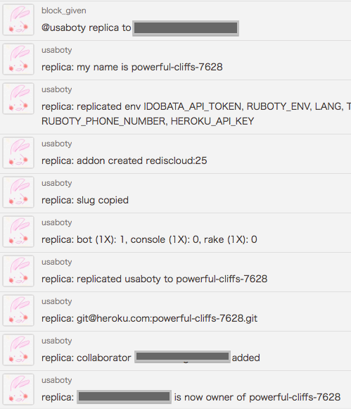

# Ruboty::Replica

ruboty plugin for replicate itself.



## Support
heroku

## Installation

Add this line to your application's Gemfile:

```ruby
gem 'ruboty-replica'
```

And then execute:

    $ bundle

Or install it yourself as:

    $ gem install ruboty-replica

## Usage

    @ruboty replica

or

    @ruboty replica to ruboty@example.com

## Contributing

1. Fork it ( https://github.com/blockgiven/ruboty-replica/fork )
2. Create your feature branch (`git checkout -b my-new-feature`)
3. Commit your changes (`git commit -am 'Add some feature'`)
4. Push to the branch (`git push origin my-new-feature`)
5. Create a new Pull Request
